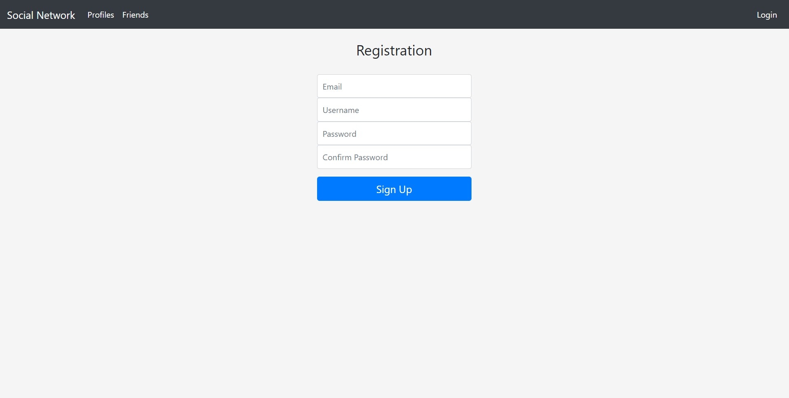
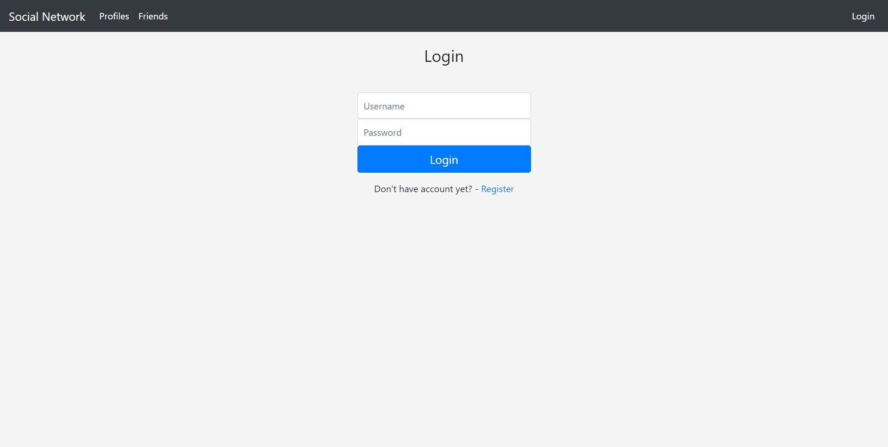
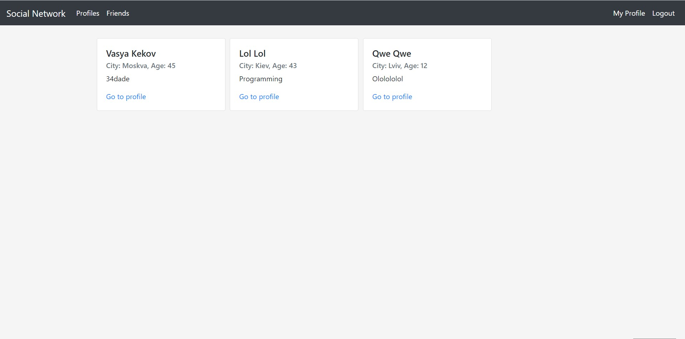
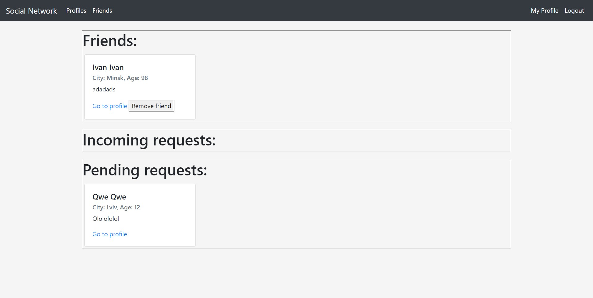

## Задание
---

Требуется разработать создание и просмотр анект в социальной сети.

Функциональные требования:
* Есть возможность регистрации
* Есть возможность создавать персональные страницы
* Авторизация по паролю.
  * Страница регистрации, где указывается следующая информация:
  * Имя
  * Фамилия
  * Возраст
  * Пол
  * Интересы
  * Город
* Возможность подружиться
* Страницы с анкетой.
* Список друзей
* Отсутствуют SQL-инъекции
* Пароль хранится безопасно

Нефункциональные требования:
* Любой язык программирования
* В качестве базы данных использовать MySQL
* Не использовать ORM
* Программа должна представлять из себя монолитное приложение.
* Не рекомендуется использовать следующие технологии:
  * Репликация
  * Шардинг
  * Индексы
  * Кэширование
* Верстка не важна. Подойдет самая примитивная.

Разместить приложение на любом хостинге. Например, heroku. ДЗ принимается в виде исходного кода на github и демонстрации проекта на хостинге.

## Результат
---

* Регистрация  
  

* Авторизация  
  

* Страница с анкетами  
  

* Страница друзей  
 

* Схема базы данных - [schema](../../src/sql/schema.sql). Пароли пользователей хранятся в хэшированном виде.
* Хостинг - AWS
