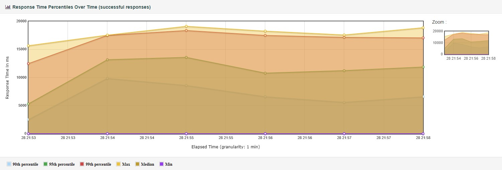

## Задание
---

Cоздать набор тестовых данных для проведения нагрузочного тестирования. Подобрать наиболее подходящие индексы и провести тесты производительности.

Требования:
1. Сгенерировать любым способ 1,000,000 анкет. Имена и Фамилии должны быть реальными (чтобы учитывать селективность индекса)
2. Реализовать функционал поиска анкет по префиксу имени и фамилии (одновременно) в вашей социальной сети (запрос в форме firstName LIKE ? and secondName LIKE ?). Сортировать вывод по id анкеты. Использовать InnoDB движок.
3. С помощью wrk провести нагрузочные тесты по этой странице. Поиграть с количеством одновременных запросов. 1/10/100/1000.
4. Построить графики и сохранить их в отчет.
5. Сделать подходящий индекс.
6. Повторить пункт 3 и 4.
7. В качестве результата предоставить отчет в котором должны быть:  
    1. графики latency до индекса;
    2. графики throughput до индекса;
    3. графики latency после индекса;
    4. графики throughput после индекса;
    5. запрос добавления индекса;
    6. explain запросов после индекса;
    7. объяснение почему индекс именно такой;


## Результат
---

1. Для генерации была использована библиотека [Bogus](https://github.com/bchavez/Bogus). Имена, фамилии, почты и адреса реальные и репрезентативные. Пример сгенерированных пользователей:
```
UserId FirstName LastName Age Interests City
1	Anabelle	Fisher	53	Veniam debitis deserunt a iure quasi.	Ericfurt
2	Reta	Gaylord	48	Veniam est commodi molestias atque ratione accusamus.	Lake Tracey
3	Rowland	Bergnaum	26	Non ducimus praesentium et aut corrupti odit totam ut quae.	North Jalon
4	Rene	Rodriguez	84	Aut eius aut laboriosam aut iusto.	West Burdetteview
5	Theo	Kling	93	Quis nihil voluptas ad consequuntur sit ad voluptatibus ratione.	Lake Kayla
6	Sonia	Haag	35	Et quod laudantium necessitatibus id.	New Rosendo
```
Скрипт для генерации пользователей [здесь](../../src/SocialNetwork.UserGenerator/Program.cs).  

2. Изначальный запрос для поска по префиксу имени и фамилии: 
```mysql
select * from UserProfile where FirstName like '@Query%' and LastName like '@Query%'
```

3. Нагрузочное тестирование проводилось с помощью jMeter, так как он обладает большей функциональностью и позволяет выполнить все тесты без написания скриптов на lua. 
Стенд для нагрузочного тестирования - 
* Ноутбук Lenovo y700-15
* Intel(R) Core(TM) i7 CPU 6700HQ 2.6 GHz
* 16 GB RAM (DDR4)
* Windows 10 Version 1909 (x64).  
* MySQL Community Server 8.0.25 (Docker 20.10.5)
Тестовый план: [social_net_test_plan](../../scripts/social_net_test_plan.jmx).  

<!-- end of the list -->

7. Отчет нагрузочного тестирования с 1000000 пользователей до и после добавления индекса. Для тестирования использовался поиск по случайному префиксу случайной длины от 1 до 3 символов. `/Profiles/Search?query=${__RandomString(${__Random(1,3)},abcdefghijklmnopqrstuvwxyz)}` в 20 и 100 параллельных потоков.  

    1. График latency до добавления индекса  
    [no_index_latency_20_connections](.\no_index_latency_20_connections.jpg):  
      
    [no_index_latency_100_connections](.\no_index_latency_100_connections.jpg):  
      
    График квантилей времени запроса  
    [no_index_percentiles_20_connections](.\no_index_percentiles_20_connections.jpg):  
      
    [no_index_percentiles_100_connections](.\no_index_percentiles_100_connections.jpg):  
      

    2. График througput до добавления индекса [no_index_throughput_20_connections](.\no_index_throughput_20_connections.jpg):  
      

    3. При исследовании запросов было обнаружено, что для валидации авторизации на каждый запрос происходит загрука текущего пользователя из базы данных по username. 
    Исходя из этого был добавлен соответствующий индекс: `alter table User add index idx_username (Username);`. После добавления throughput увеличился до 3.6 rps.

    4. График latency после добавления индекса  
    [index_latency_20_connections](.\index_latency_20_connections.jpg):  
      
    График квантилей времени запроса  
    [index_percentiles_20_connections](.\index_percentiles_20_connections.jpg):  
      

    5. График latency после добавления индекса и пагинации
    [index_paged_latency_30_connections](.\index_paged_latency_30_connections.jpg):  
      
    График квантилей времени запроса  
    [index_paged_percentiles_30_connections](.\index_paged_percentiles_30_connections.jpg):  
      

    6. График througput после добавления индекса [index_throughput_20_connections](.\index_throughput_20_connections.jpg):  
      

    7. График througput после добавления индекса и пагинации [index_paged_throughput_30_connections](.\index_paged_throughput_30_connections.jpg):  
      

    8. Запрос добавления индекса: `alter table UserProfile add index idx_first_last_name (LastName(5), FirstName(7));`

    9. Explain запросов после добавления индекса  
        ```
        -> Filter: ((UserProfile.LastName like 'co%') and (UserProfile.FirstName like 'co%'))  (cost=19380.54 rows=4490) (actual time=8.180..276.572 rows=277 loops=1)
            -> Index range scan on UserProfile using idx_first_last_name  (cost=19380.54 rows=40410) (actual time=0.062..270.705 rows=21042 loops=1)
        ```

    10. Объяснение почему индекс именно такой.  
    Была исследована возможность использования полнотекстового индекса. Запрос На добавление:  
        ```mysql
        alter table UserProfile add fulltext index idx_first_name (FirstName);
        alter table UserProfile add fulltext index idx_last_name (LastName);
        ```  
        Запрос на выбор:
        ```mysql
        select * from UserProfile 
        WHERE MATCH(LastName) AGAINST('+o*' in boolean mode) and
            MATCH(FirstName) AGAINST('+o*' in boolean mode);
        ```
        В результате полнотекстовый индекс практически не показал прироста в производительности, и было решено использовать более подходящий префиксный BTREE индекс.
        Для определения необходимой длины префикса была посчитана селекстивность префиксов для имени и фамилии:
        ```mysql
        select count(DISTINCT LastName)/count(LastName) as originalSelectivity, 
        count(DISTINCT left(LastName,1))/count(LastName) as prefix1, 
        count(DISTINCT left(LastName,2))/count(LastName) as prefix2, 
        count(DISTINCT left(LastName,3))/count(LastName) as prefix3, 
        count(DISTINCT left(LastName,4))/count(LastName) as prefix4, 
        count(DISTINCT left(LastName,5))/count(LastName) as prefix5, 
        count(DISTINCT left(LastName,6))/count(LastName) as prefix6, 
        count(DISTINCT left(LastName,7))/count(LastName) as prefix7, 
        count(DISTINCT left(LastName,8))/count(LastName) as prefix8, 
        count(DISTINCT left(LastName,9))/count(LastName) as prefix9, 
        count(DISTINCT left(LastName,10))/count(LastName) as prefix10
        from UserProfile;

        select count(DISTINCT FirstName)/count(FirstName) as originalSelectivity, 
        count(DISTINCT left(FirstName,1))/count(FirstName) as prefix1, 
        count(DISTINCT left(FirstName,2))/count(FirstName) as prefix2, 
        count(DISTINCT left(FirstName,3))/count(FirstName) as prefix3, 
        count(DISTINCT left(FirstName,4))/count(FirstName) as prefix4, 
        count(DISTINCT left(FirstName,5))/count(FirstName) as prefix5, 
        count(DISTINCT left(FirstName,6))/count(FirstName) as prefix6, 
        count(DISTINCT left(FirstName,7))/count(FirstName) as prefix7, 
        count(DISTINCT left(FirstName,8))/count(FirstName) as prefix8, 
        count(DISTINCT left(FirstName,9))/count(FirstName) as prefix9, 
        count(DISTINCT left(FirstName,10))/count(FirstName) as prefix10
        from UserProfile;
        ```
        Результаты выполнения запросов следующие:
        ```
        LastName
        # originalSelectivity	prefix1	prefix2	prefix3	prefix4	prefix5	prefix6	prefix7	prefix8	prefix9	prefix10
        0.0005	                0.0000	0.0001	0.0003	0.0004	0.0005	0.0005	0.0005	0.0005	0.0005	0.0005

        FirstName
        # originalSelectivity	prefix1	prefix2	prefix3	prefix4	prefix5	prefix6	prefix7	prefix8	prefix9	prefix10
        0.0030	                0.0000	0.0002	0.0009	0.0018	0.0024	0.0027	0.0029	0.0030	0.0030	0.0030
        ```
        Из результатов были выбраны длины префиксов LastName(5) и FirstName(7).

    11. Также было замечено, что количество результатов неравномерное, и может быть очень большим при коротких запросах (особенно 1 символ). В этом случае индекс работает недостаточно хорошо, а количество строк результата может быть большим (более 3000 при query='a'). При увелиичении количества пользователей количество записей в результате также будет увеличиваться, поэтому было решено использовать пагинацию. Результирующий запрос - 
        ```mysql
        select * from UserProfile 
        where FirstName like @Query and LastName like @Query
        limit {pageSize} offset {page * pageSize}"
        ```


Использованные источники:  
* http://code-epicenter.com/prefixed-index-in-mysql-database/
* https://stackoverflow.com/questions/224714/what-is-full-text-search-vs-like
* https://dev.mysql.com/doc/refman/8.0/en/fulltext-search.html
* https://dev.mysql.com/doc/refman/8.0/en/column-indexes.html
* https://www.youtube.com/watch?v=WDJRRNCGIRs
* https://www.eversql.com/faster-pagination-in-mysql-why-order-by-with-limit-and-offset-is-slow/
        