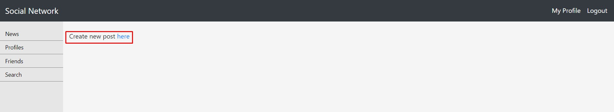
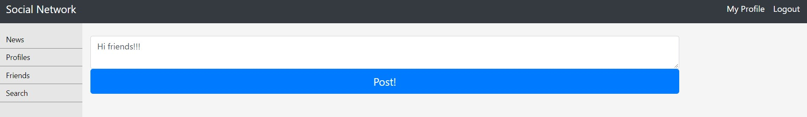
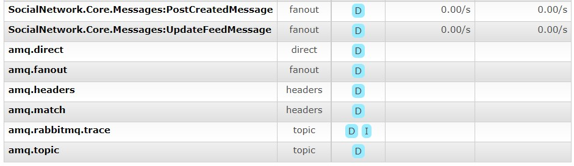
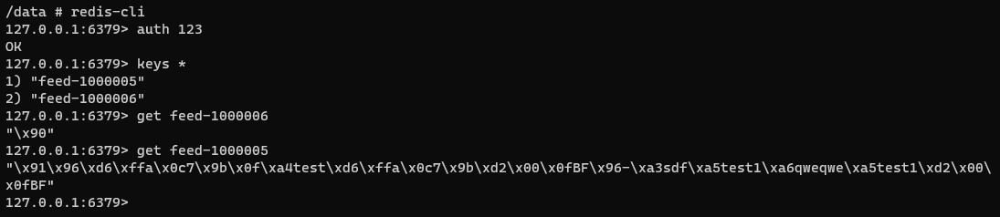
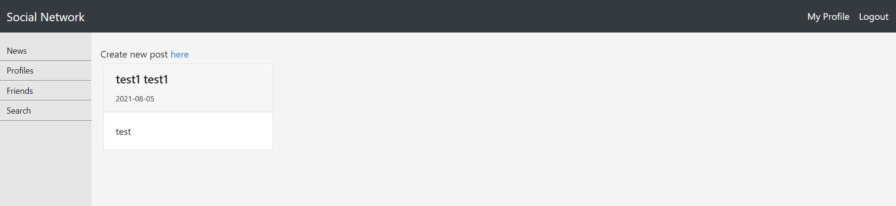

## Задание
---

Разработать ленту новостей. Добавить функционал "добавление поста". Создается отдельная страница, куда пишутся все обновления друзей. Для этого нужно хранить подписчиков. Лента формируется на уровне кешей. Формирование ленты производить через постановку задачи в очередь на часть подписчиков, чтобы избежать эффекта леди Гаги. В ленте держать последние 1000 обновлений друзей. Лента должна кешироваться.

Требования: Верно работает инвалидация кеша. Обновление лент работает через очередь. Есть возможность перестройки кешей из СУБД.

## Результат
---

В результате выполнения работы была создана таблица UserPost. Для упрощения концепции посты представлены в виде plain text а-ля Twitter.
Для выполнения были выбраны следующие инструменты:
* Брокер сообщений - RabbitMq
* C# Клиент для RabbitMq - Masstransit
* Кэш - Redis (возможно будет заменен на Tarantool в следующих работах)

Флоу следующий:
1. Пользователь со страницы новостей переходит на страницу создания поста  
    
2. После публикации поста в брокер отправляется сообщение о создании поста  
    
3. Сообщение о создании поста попадает в очередь и направляется в обработчик  
    
4. Обработчик берет всех друзей и подписчиков и рассылает сообщение об обновлении фида батчами по 1000 пользователей
5. Сообщение об обновлении фида попадает в очередь и направляется в обработчик
6. Для каждого пользователя лента хранится в redis по ключу feed-{userId}. Посты сериализуются MessagePack для оптимизации сериализации и объема данных. При обновлении новый пост добавляется к ленте  
    
7. В случае перезагрузки кэша он будет перезаполнет постами из базы, и затем будет дополняться новыми  

Cтраница новостей:  
  
