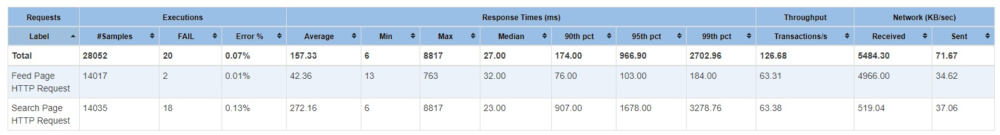

## Задание
---

<br/>

1. Настраиваем асинхронную репликацию.
  * Выбираем 2 любых запроса на чтения (в идеале самых частых и тяжелых по логике работы сайта) и переносим их на чтение со слейва.
  * Делаем нагрузочный тест по странице, которую перевели на слейв до и после репликации. Замеряем нагрузку мастера (CPU, la, disc usage, memory usage).
  * ОПЦИОНАЛЬНО: в качестве конфига, который хранит IP реплики сделать массив для легкого добавления реплики. Это не самый правильный способ балансирования нагрузки. Поэтому опционально.
2. Полусинхронная репликация
  * Настроить 2 слейва и 1 мастер.
  * Включить row-based репликацию.
  * Включить GTID.
  * Настроить полусинхронную репликацию.
  * Создать нагрузку на запись в любую тестовую таблицу. На стороне, которой нагружаем считать, сколько строк мы успешно записали.
  * С помощью kill -9 убиваем мастер MySQL.
  * Заканчиваем нагрузку на запись.
  * Выбираем самый свежий слейв. Промоутим его до мастера. Переключаем на него второй слейв.
  * Проверяем, есть ли потери транзакций.

Требования: В отчете корректно описано, как настроена репликация. 2 запроса переведено на чтение со слейва. Нагрузочное тестирование показало, что нагрузка перешла на слейв. В отчете описано как включить row-based репликацию и GTID Проведен эксперимент по потере и непотере транзакций при аварийной остановке master.

<br/>

## Результат
---

<br/>

### Часть 1 (Асинхронная репликация)

<br/>
  
Настраиваем асинхронную репликацию:

1. Разворачиваем 2 контейнера в докере с лимитами по производительности для проверки нагрузки. [Скрипт](../../scripts/mysql-async-replication.yml)
2. Проверяем, что mysql запущен
  ```bash
  > mysql -u root -p
  ```
3. Задаем server id на мастере и слейве. 
  ```mysql
  mysql> SET GLOBAL server_id = 1;
  mysql> SET GLOBAL server_id = 2;
  ```
4. Создаем юзера для репликации на мастере.  
  ```mysql
  mysql> create user 'repl' identified by '123';
  mysql> grant replication slave on *.* to repl; 
  ```
5. Для синхронизации необходимо перенести все данные с мастера на слейв. Для этого включаем лок на чтение, и делаем дамп базы. 
  ```mysql
  mysql> FLUSH TABLES WITH READ LOCK;
  mysql> SHOW MASTER STATUS;
  ```
6. Сделаем дамп базы
  ```bash
  > mysqldump --user="root" --password="" --all-databases --master-data > dbdump.db
  ```
7. Перенесем дамп между контейнерами (по умолчанию докер не поддерживает перенос файлов между контейнерами) 
  ```bash
  > docker cp mysql_master:/dbdump.db D:\temp\dbdump.db
  > docker cp D:\temp\dbdump.db mysql_replica-1:/dbdump.db
  ```
8. Поднимаем дамп на слейве: 
  ```bash
  > mysql -u root -p < dbdump.db
  ```
9. Задаем мастера для слейва 
  ```mysql
  mysql> CHANGE MASTER TO
        MASTER_HOST='mysql_master',
        MASTER_USER='repl',
        MASTER_PASSWORD='123',
        MASTER_LOG_FILE='binlog.000002',
        MASTER_LOG_POS=1355;
  ```
10. Разблокируем таблицы на мастере
  ```mysql
  mysql> UNLOCK TABLES;
  ```
11. Перезагружаем слейва
  ```mysql
  mysql> stop slave;
  mysql> start slave;
  ```
12. Фиксим ошибку авторизации (в проде нужно настраивать сертификаты, для тестов можно отключить):
  ```mysql 
  mysql> alter user 'repl' IDENTIFIED WITH mysql_native_password BY '123';
  ```

<br/>

Для подключения к replica set сначала был использован стандартный MySQL connector с указанием нескольких серверов. Однако результаты показали, что под нагрузкой он выдает очень много ошибок, в результате чего было решено реализовать простой кастомноый пул соединений. Для записи используется только master, запросы на чтение уходят на случайно выбранную базу (реплику или мастер).
Конфигурация задается в [настройках](../../src/SocialNetwork.Web/appsettings.json) в виде:
```json
"MySQL": {
  "ConnectionStrings": [
    {
      "Name": "Master",
      "ConnectionString": "Server=localhost;Port=3306;Database=SocialNetwork;Uid=root;Pwd=admin;",
      "Type": "Master"
    },
    {
      "Name": "Async slave 1",
      "ConnectionString": "Server=localhost;Port=3307;Database=SocialNetwork;Uid=root;Pwd=admin;",
      "Type": "Slave"
    }
  ] 
}
```

Нагрузочное тестирование проводилось аналогично дз2 с помощью jMeter. Нагрузка создавалась на 2 самых тяжелых запроса: фид новостей (для теста кэш был отключен), а также поиск пользователей. [Скрипт](../../scripts/social_net_test_plan.jmx)

Результаты с одной мастер-базой:
* Нагрузка только на одну базу  
  
* Througput на 2 запроса - 67rps  
 

Результаты после подключения реплики:
* Нагрузка поделилась между двумя базами  
  
* Througput на 2 запроса - 126rps (вырос практически в 2 раза)  
 


<br/>
<br/>

### Часть 2 (Полусинхронная gtid репликация)

<br/>

Настраиваем полусинхронную репликацию:

1. Настраиваем [конфиг](../../scripts/config/mysql_gtid.cnf) gtid репликации для всех инстасов MySQL.
2. Разворачиваем 3 контейнера в докере (1 мастер и 2 слейва). [Скрипт](../../scripts/mysql-gtid-replication.yml)
3. Проверяем, что mysql запущен
  ```bash
  > mysql -u root -p
  ```
4. Задаем server id на мастере и слейвах. 
  ```mysql
  mysql> SET GLOBAL server_id = 1; -- master
  mysql> SET GLOBAL server_id = 2; -- slave 1
  mysql> SET GLOBAL server_id = 3; -- slave 2
  ```
5. Создаем юзера для репликации на мастере.  
  ```mysql
  mysql> create user 'repl' identified by '123';
  mysql> grant replication slave on *.* to repl; 
  ```
6. Проверяем, что задан верный binlog_format (ROW).  
  

7. Задаем мастера для слейвов
  ```mysql
  mysql> CHANGE MASTER TO
        MASTER_HOST='mysql_master',
        MASTER_USER='repl',
        MASTER_PASSWORD='123',
        MASTER_AUTO_POSITION = 1;
  ```
8. Перезагружаем слейвы
  ```mysql
  mysql> stop slave;
  mysql> start slave;
  ```

<br/>

Эксеримент по (не)потере транзакций проводился следующим образом: 
1. Была создана тестовая gtid и таблица numbers.
2. Было реализовано [тестовое приложение](../../src/SocialNetwork.GtidReplication/Program.cs), создающее пул потоков, которые параллельно создают транзакции на вставку в данную таблицу.
3. Данное приложение считает количество успешно закоммиченных транзакций, и выводит в конце работы.
4. В момент работы программы был убит мастер: `docker kill mysql_master`;
5. Резутат работы программы следующий: 734 успешных коммита из 1000.  
  

6. Сразу после этого выполнены запросы на обеих репликах. Количество записей в таблице также составило 734  
  

7. После реанимации мастера оказалось, что там осталось 6 транзакций, которые были записаны, но еще не попали в бинлог. После восстановления соединения данные транзакции были проиграны на всех слейвах:  
  

Результат эксеримента: все транзакции, попавшие на мастер, были исполнены на слейвах после восстановления соединения.

---
### Использованные источники

* https://dev.mysql.com/doc/refman/8.0/en/replication.html
* https://stackoverflow.com/questions/49194719/authentication-plugin-caching-sha2-password-cannot-be-loaded
* https://dev.mysql.com/doc/mysql-shell/8.0/en/mysql-innodb-cluster.html
* https://dev.mysql.com/doc/refman/8.0/en/mysqldump.html
* https://dev.mysql.com/doc/refman/8.0/en/replication-formats.html
* https://dev.mysql.com/doc/refman/8.0/en/replication-gtids.html
