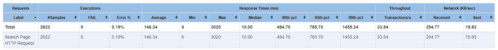
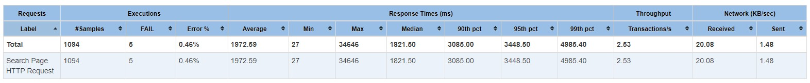
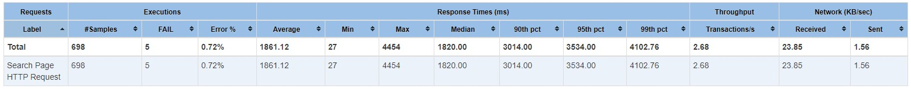
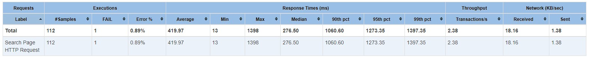
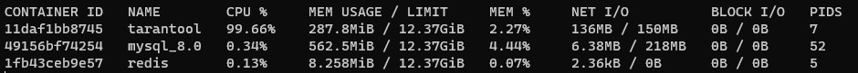

## Задание
---

1. Выбрать любую таблицу, которую мы читаем с реплик MySQL.
2. С помощью программы https://github.com/tarantool/mysql-tarantool-replication настроить реплицирование в tarantool (лучше всего версии 1.10).
3. Выбрать любой запрос и переписать его на lua-процедуру на tarantool.
4. Провести нагрузочное тестирование, сравнить tarantool и MySQL по производительности.

Требования: Репликация из MySQL в tarantool работает. Хранимые процедуры в tarantool написаны корректно. Хранимые процедуры выполнены по code style на примере репозитория Mail.Ru. Нагрузочное тестирование проведено.

## Результат
---

<br/>

### Развертывание
В результате выполнения работы был поднят docker-образ Tarantool. Скрипт docker-compose:
```yml
tarantool:
  image: "tarantool/tarantool:1.10.9"
  container_name: 'tarantool'
  ports:
    - "3301:3301"
  volumes:
    - tarantool-data:/var/lib/tarantool
    - ./tarantool:/usr/local/share/tarantool
```
Изначально была выбрана последняя версия (2.9). Однако позже выяснилось, что ни репликатор, ни .NET коннектор не работают с этой версией. Поэтому пришлось откатывать на 1.10.

<br/>

### Настройка репликации

Что касается репликации, то утилита https://github.com/tarantool/mysql-tarantool-replication судя по всему не поддерживается уже несколько лет, и имеет некоторые проблемы. Собрать ее ни под Windows, ни под WSL2 не получилось. 

Поэтому было решено реализовать решение для репликации под конкретную задачу. Исходники можно найти [здесь](../../src/SocialNetwork.TarantoolReplicator/Program.cs). Представляет из себя фоновую джобу, которая периодически делает следующее:
1. Пытатается создать space для профилей пользователей (user_profile), а также для метаинформации (meta).  
```lua
box.schema.create_space('user_profiles', {if_not_exists = true})
box.schema.create_space('meta', {if_not_exists = true})
```
2. Пытатается создать primary индексы, а также индекс для поиска по first name и last name в user_profiles.Для строк используем `collation = 'unicode_ci'`, чтобы искать вне зависимости от регистра.
```lua
box.space.user_profiles:create_index('primary', {unique = true, if_not_exists = true, parts = {{field = 1, type = 'unsigned'}}})
box.space.meta:create_index('primary', {unique = true, if_not_exists = true, parts = {{field = 1, type = 'unsigned'}}})
box.space.user_profiles:create_index('name', {unique = false, if_not_exists = true, parts = {{field = 2, type = 'string', collation = 'unicode_ci'}, {field = 3, type = 'string', collation = 'unicode_ci'}}})
```
3. Берет id последнего синхронизированного пользователя из space.meta
4. Проверяет, появились ли пользователи с id выше
5. В случае если такие есть, то загружает их из mysql в tarantool и сохраняет в space.meta id последнего пользователя.

Недостаток такого подхода: не будет подтягиваться информация об изменениях профиля. Однако ее можно решить, сохраняя в профиле дату последнего изменения, и забирая из базы последние измененнные вместе с последними добавленными.


<br/>

### Запросы

При инициализации Tarantool вызывается файл [init.lua](../../scripts/tarantool/init.lua), который содержит процедуру поиска пользователей по префиксу имени и фамилии.
```lua
function find_profiles(prefix, offset, limit)
  local ret = {}
  local iterated_count = 0
  
  prefix = prefix:lower()

  for _, tuple in box.space.user_profiles.index.name:pairs(prefix, {iterator = 'ge'}) do
    if string.startswith(tuple[2]:lower(), prefix) and string.startswith(tuple[3]:lower(), prefix) then
      
      if iterated_count >= offset + limit then break end

      if iterated_count >= offset then
        table.insert(ret, tuple)
      end

      iterated_count = iterated_count + 1
    end
  end
  return ret
end
```
Индекс по строкам в tarantool не имеет возможности искать по префиксу. Для этого необходимо итерироваться по всем результатам 'ge' итератора, что очень сильно увеличивает время работы процедуры.

<br/>

### Бенчмарк

Тест производительности проводился аналогично домашкам 2 и 4 с помощью apache jmeter ([Скрипт](../../scripts/social_net_test_plan.jmx)). Для тестирования был выбран запрос поиска по префиксам имен пользователей. Количество записей в таблице при тесте - 1000006.

1. Для начала проверим производительность одной мастер-ноды MySQL  
  
Получаем аналогично предыдущим тестам примерно <b>34rps</b>.  

Затем пришло время тестировать Tarantool, и результаты показалисть странными. Поэтому для исключения оверхеда на каждое подключение был реализован пулинг соединений, и проведены тесты при разном размере пула соединений, а также при разном количестве нагружающих потоков.

Код вызова процедуры из .NET клиента progaudi.tarantool:
```C#
var profileTuples = await tarantoolClient.Call_1_6<
                    TarantoolTuple<string, int, int>,
                    TarantoolTuple<long, string, string, int, string, string>>("find_profiles", TarantoolTuple.Create(query, page * pageSize, pageSize));
```

2. Результаты нагрузочного тестированаия процедуры Tarantool при пуле из 15 соедиенений и 20 нагружающих потоках  
  

3. Результаты нагрузочного тестированаия процедуры Tarantool при пуле из 5 соедиенений и 20 нагружающих потоках  
  

4. Результаты нагрузочного тестированаия процедуры Tarantool при пуле из 5 соедиенений и 1 нагружающем потоке 
  

Нагрузка на Tarantool во время выполнения теста:  
   

Как можно видеть, результаты практически не зависят ни от количества клиентских соединений, ни от объема нагрузки. Разницу можно списать на погрешность. Итоговый результат во всех случаях составляет <b>~2.5rps</b>!

<br/>

### Выводы

Как можно видеть, в данном кейсе (поиск по префиксу строки с игнорированием регистра) Tarantool показал себя намного хуже одной ноды MySQL с индексом. 

Предположение, почему так могло произойти, следующее: 
Исходя из докладов разработчиков Tarantool было выяснено что он условно однопоточный, т.е. все запросы выполняются в одном потоке. Данный поток не будет переключаться на следующий запрос, пока не выполнит предыдущий. Это работает очень хорошо на большом количестве легких запросов, однако плохо при тяжелых запросах. Примем во внимание то, что поиск по префиксу строки в Tarantool не реализован, и нам приходится перебирать все результаты ge итератора для поиска нужных вариантов. Таких вариантов на порядки больше, особенно для лексикографически малых строк 'a', 'aa', 'b', ... Для таких строк нам придется пройтись итератором почти по всем записям, что есть очень плохо. Соотвественно каждый из таких запросов тяжелый, и Tarantool начинает не справляться при большом количестве запросов.

Эксперимент можно считать успешным, так как из него можно извлечь вывод. 
Под каждую задачу нужен свой инструмент, и возможные пути решения должны быть исследованы. Inmemory базы данных - это не всегда быстро. Очень часто оказывается, что такие молодые решения действительно очень быстры только в тех задачах, под которые они заточены и имеют очень ограниченный набор фич. В данном кейсе оказалось, что для задачи поиска по префиксу строки Tarantool не оправдал ожиданий, и показал перфоманс намного хуже, чем MySQL.