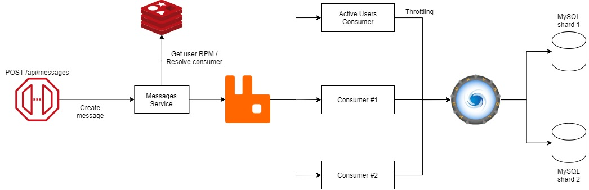

## Задание
---

Необходимо написать систему диалогов между пользователями. Обеспечить горизонтальное масштабирование хранилищ на запись с помощью шардинга. Предусмотреть:  
* Возможность решардинга
* “Эффект Леди Гаги” (один пользователь пишет сильно больше среднего)

Требования: Верно выбран ключ шардирования с учетом "эффекта Леди Гаги" В отчете описан процесс решардинга без даунтайма

## Результат
---

<br/>

### Проектирование

<br/>

В результате выполнения задачи была спроектирована следующая структура сервиса личных сообщений:

  

<br/>
<br/>

### Структура базы данных  

<br/>

```MySQL
CREATE TABLE IF NOT EXISTS  `Chat` (
    `Id` BIGINT NOT NULL AUTO_INCREMENT,
    `IsPersonal` BOOLEAN NOT NULL,
    CONSTRAINT `PK_Chat` PRIMARY KEY (`Id`)) ENGINE = INNODB;


CREATE TABLE IF NOT EXISTS  `ChatMember` (
    `Id` BIGINT NOT NULL AUTO_INCREMENT,
    `ChatId` BIGINT NOT NULL,
    `UserId` BIGINT NOT NULL,
    CONSTRAINT `PK_ChatMember` PRIMARY KEY (`Id`),
    CONSTRAINT `FK_ChatMember_UserId_UserProfile_Id` 
        FOREIGN KEY (`UserId`) 
        REFERENCES `UserProfile` (`UserId`)) ENGINE = INNODB;


CREATE TABLE IF NOT EXISTS  `ChatMessage` (
    `Id` BIGINT NOT NULL AUTO_INCREMENT,
    `ChatId` BIGINT NOT NULL,  
    `SenderId` BIGINT NOT NULL,  
    `ChatLocalId` INTEGER NOT NULL, 
    `Text` TEXT NOT NULL, 
    `Created` DATETIME NOT NULL,
    `Updated` DATETIME NOT NULL,
    `IsDeleted` BOOLEAN NOT NULL,
    CONSTRAINT `PK_Message` PRIMARY KEY (`Id`)) ENGINE = INNODB;
    
alter table ChatMessage add index idx_chatId (ChatId);
```
При этом таблицы Chat и ChatMember могут храниться в основной базе, так как содержат метаинформацию и на запросы к ним не приходится большая часть нагрузки. Каждое сообщение имеет глобальный идентификатор (Id) - уникальный в рамках шарда. Также каждое сообщение имеет уникальный идентификатор в рамках чата - ChatLocalId, который может быть использован для удобства операций внутри одного чата.

<br/>

На основе анализа известных архитектур таких ситем, как Facebook Messenger, VK, Pinterest было принято решение, что все сообщения чата должны находиться на одном шарде для облегчения простоты доступа к данным, а также возможности будущего решардинга. Исходя из этого получаем следующие алгоритмы загрузки чата и записи сообщения:

### Алгоритм публикации сообщения 

1. Запрос попадает в систему через API
2. Сервис сообщений идет в Redis за текущим RPM пользователя.
3. На основе этой информации определяется "Lady Gaga" - активный пользователь, который пишет много сообщений. Его сообщение помечается соответствующей меткой
4. Сообщение отправляется в RabbitMQ в соответсвующую очередь. Здесь можно делать троттлинг активных пользователей, чтобы не заваливать базу запросами.
5. Сообщение направлятся соответствующему consumer'у
6. Consumer на основе сконфигурированных промежутков chat_id (range sharding) определяет id шарда, на котором находится данный чат.  
7. Производится запись в соответствующий шард.

<br/>

### Алгоритм загрузки сообщений чата

1. Запрос попадает в систему через API
2. Сервис сообщений на основе сконфигурированных промежутков chat_id (range sharding) определяет id шарда, на котором находится данный чат.  
3. Производится чтение из соответствующего шарда.

<br/>

### Алгоритм решардинга

Алгоритм решардинга похож на упрощенную версию алгоритма решардинга / миграции Facebook Messenger

1. Запрос попадает в систему через API
2. Сервис сообщений на основе сконфигурированных промежутков chat_id (range sharding) определяет id шарда, на котором находится данный чат.  
3. Производится чтение из соответствующего шарда.

<br/>

### Точки расширения

Также были предусмотрены следующие точки расширения, которые могут быть исопльзованы при росте нагрузки на систему:
1. API Gateway для горизонтального масштабирования сервисов сообщений
2. Запись может масштабироваться горизонтально благодаря брокеру сообщений
3. База может масштабироваться горизонтально благодаря ProxySQL - добавляем инстансы, указываем в конфигурации.

### Использованные источники