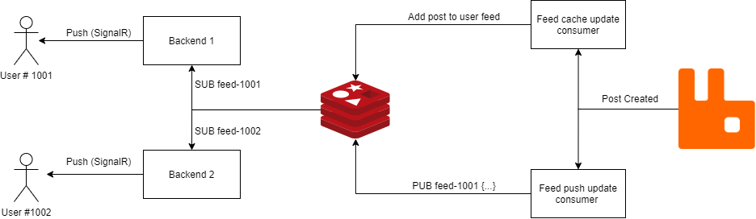
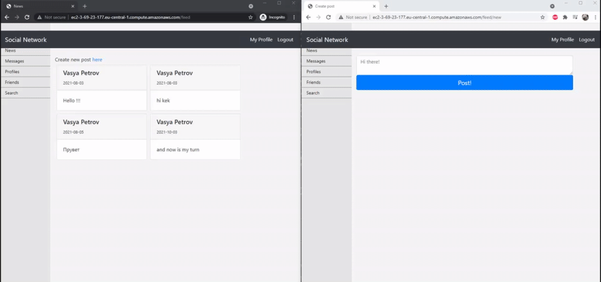
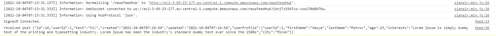

## Задание

Разработать компонент, куда будет подключаться клиент при открытии страницы ленты. Сервис должен слушать очередь обновлений ленты. При получении подписанным клиентом сообщения, отправлять его в браузер по WebSocket. Учесть возможность масштабирования сервиса. То есть сообщение должно доставляться только на тот экземпляр компонента, куда соединен клиент. Для этого можно использовать, например Routing Key из Rabbitmq.

## Результат

### Алгоритм и архитектура

Для обновления ленты новостей было решено использовать Redis Pub/Sub. Причины выбора его, а не обновление напрямую из RabbitMQ следующие:
1. Redis уже используется для хранения кэша лент новостей каждого из пользователей. Обновления также логично отправлять через redis.
2. Для каждого пользователя у нас есть персональная лента, соответственно обновления должны отправляться на все клиенты, через которые подключен пользователь (может быть подключен к разным шардам бэкенда). Со стороны бэкенда сокетов тяжело реализовать динамическое обновление подписок на UserId routing key.
3. Создание лишней нагрузки на RabbitMQ, с которой он может не справиться.
4. Данная функциональность не критична, поэтому гарантии RabbitMq могут быть излишни (нет смысла в ивентах обновления, если кэш упал).
5. Возможность горизонтального масштабирования Redis.

Был разработан следующий алгоритм обновления ленты новостей в реальном времени:  
1. Подписка на события  
   1.1. При открытии страницы ленты новостей создается SignalR соединение с некоторым бэкендом.  
   1.2. Если пользователь залогинен, данный бэкенд начинает слушать обновления Redis для этого пользователя. `SUB feed-1001`.  
   1.3. При отключении пользователя просходит отписка событий пользователя в redis.  
2. Пуш события  
   2.1. При создании поста событие пушится в RabbitMQ в FeedUpdate exchange  
   2.2. Feed Push update consumer получает сообщение
   2.3. Сообщение сериализуется и отправляется в перскольный канал пользователя в Redis. `PUB feed-1001 {...}`.
   2.4. Все подписанные на обновления этого пользователя (на которых у него есть активные сессии) бэкенды получают событие.
   2.5. По веб-сокету пользователю в браузер (на любой другой клиент) отправляется обвновление.
   2.6. Клиент отрисовывает обновление.

Архитектура решения схематично может быть представлена в следующем виде:

### Демонстрация

Приложение было задеплоено на aws ec2 виртуалку. В тестовом стенде использованы 2 юзера, которые являются друзьями (соответственно могут видеть новости друг друга). Один пользователь открывает страницу новостей. Второй в это время создает пост. Как можно видеть, первому пользователю приходит уведомление, и пост появляется без обновления страницы.

Для тестовых целей был сделан вывод получаемых собыний в консоль. Получаемое сообщение выглядит следующим образом:

### Точки расширения

Также были предусмотрены следующие точки расширения, которые могут быть исопльзованы при росте нагрузки на систему:
1. Бэкенды могут быть горизонтально масштабированы, так как не хранят состояние пользователя
2. Redis может быть горизонтально масштабирован.

### Использованные источники
* https://dotnet.microsoft.com/apps/aspnet/signalr
* https://tsh.io/blog/how-to-scale-websocket/
* https://redis.io/topics/pubsub