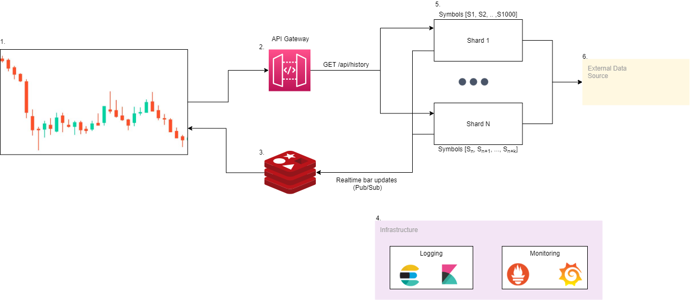
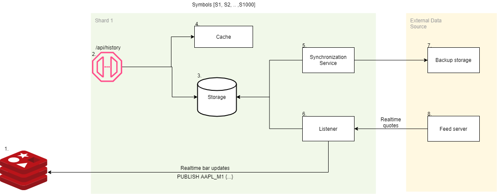
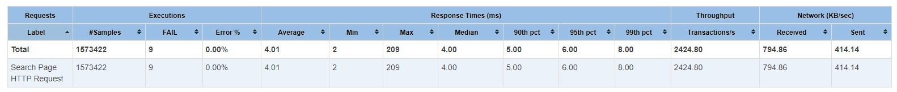
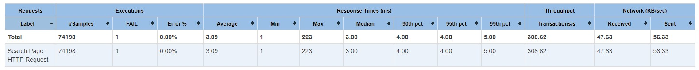
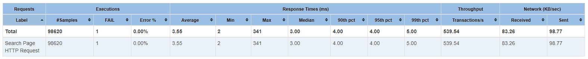
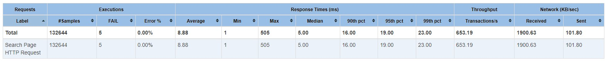

# Проектная работа "Высоконагруженный сервис торговой истории (OHLC данных)"

Данная проектная работа выполнена в рамках курса OTUS ["Highload Architect"](https://otus.ru/lessons/highloadarchitect)

## Содержание

**[1. Введение](#intro)**

**[2. Мотивация](#motivation)**

  * [2.1. Объем данных](#motivation-data)

**[3. Цели проекта](#goals)**

  * [3.1. Масштабирование](#goals-scalability)
  * [3.2. Отказоустойчивость](#goals-reliability)
  * [3.3. Производительность](#goals-performance)

**[4. Разработанная архитектура](#architecture)**

  * [4.1. Общая схема](#architecture-scheme)
  * [4.2. Устройство шарда](#architecture-shard)
  * [4.3. Пример разбиения на шарды](#architecture-example)

**[5. Исследование оптимального хранилища](#storage)**

  * [5.1. Постановка задачи](#storage-task)
  * [5.2. Профиль нагрузки](#storage-profile)
  * [5.3. Тестовые данные и метод тестирования](#storage-test)
  * [5.4. Исследованные хранилища](#storage-investigration)
  
      * [5.4.1. SQLServer](#storage-investigration-sqlserver)
      * [5.4.2. PostgreSQL](#storage-investigration-postgres)
      * [5.4.3. TimescaleDB](#storage-investigration-timescale)
      * [5.4.4. Redis](#storage-investigration-redis)
      * [5.4.5. InfluxDB 2.0](#storage-investigration-influx)
      * [5.4.6. VictoriaMetrics](#storage-investigration-victoris)
      * [5.4.7. Singledtore](#storage-investigration-singlestore)
      * [5.4.8. MongoDB](#storage-investigration-mongo)
      * [5.4.9. Custom store](#storage-investigration-custom)
  
  * [5.5. Сравнительный обзор](#storage-comparison)
  * [5.6. Выводы](#storage-results)

**[6. Разработка MVP](#mvp)**

  * [6.1. Цели MVP](#mvp-goals)
  * [6.2. Что вошло в MVP](#mvp-structure)
  * [6.3. Нагрузочное тестирование](#mvp-loadtesting)

**[7. План развития](#plan)**

  * [7.1. Обновления графиков в реальном времени](#plan-realtime)
  * [7.2. Разработка хранилища](#plan-storage)
  * [7.3. Консистентность кэша в реальном времени](#plan-cache)

**[8. Выводы](#conclusion)**

**[9. Ссылки](#refs)**

 

## 1. Введение

Одна из важных функций торговой платформы - предоставление пользователям инструментов по анализу торговой истории. На основе этого могут приниматься решения о совершении сделок, их объемах и т.д. Для брокера важно обеспечивать всем пользователям доступ к этим инструментам и данным.

Далее в отчете будут использоваться следующие термины:
1. Свеча (англ. OHLC/Bar/Candle). Представляет собой агрегированную информацию о движении цены инструмента за определенный период. Включает в себя такие значения, как: O (Open) - цена открытия, H (High) - наибольшая цена за период, L (Low) - наименьшая цена за период, C (Close) - цена закрытия, V(Volume) - суммарный объем сделок за период.

2. Период - временной интервал, за который измеряется изменение цен. В данной платформе имеем следующие периоды: M1 - 1 минута, M5 - 5 минут, M15 - 15 минут, M30 - 30 минут, H1 - 1 час, H4 - 4 часа, D1 - 1 день, W1 - 1 неделя, MO1 - 1 месяц

3. Чарт - интерактивный график изменения цены.   

 

## 2. Мотивация

В стартовой точке имеем следующую ситуацию: есть монолитный бэкенд торговой платформы, который отвечает за обслуживание клиентов, построение котировок и баров, исполнение ордеров и т.д. Все приложение находится на одном хосте, соответственно не может быть масштабировано. Также имеют место проблемы с отказом/замедлением других сервисов при большой нагрузке на один из них. Также со временем и увеличением количества данных сервис торговой истории деградировал до небольших показателей RPS на очень мощном сервере.   
В результате было принято решение, что вертикальное масштабирование уже не может решить проблему, и необходимо отпилить от монолита сервис торговой истории. Данный сервис должен стать независимым от других частей системы, горизантально масштабируемым, и выдерживать бОльшие нагрузки по сравнению с текущим вариантом.

### 2.1. Объем данных

 

## 3. Цели проекта

Для устранения текущих проблем, и, соответственно, успешной реализации проекта были поставлены следующие цели:

### 3.1. Масштабирование

Система должна иметь возможность горизонтального масштабирования. Как везде в торговле, логичнее всего шардировать по торговому инструменту. Например все запросы для инструмена AAPL обслуживается шардом 1, а для инструмента BTC/USD - шардом 5. 

### 3.2. Отказоустойчивость

Система должна иметь лучшую отказоустойчивость, чем текущая система. При деградации одной из других систем (торговля), либо при деградации самой системы не должны деградировать и отказывать другие системы.

### 3.3. Производительность

Система должна иметь лучшую производительность, чем текущая система. Ожидается улучшение пропускной способности в 10 раз (при возможности дальнейшего масштабирования).

 

## 4. Разработанная архитектура

Для решения всех поствленных задач и достижения целей была разработана следующая архитектура новой системы:

### 4.1. Общая схема  

Основные компоненты:  
1. Графики пользователей. Строятся на основании данных, полученных через API, обновляются в реальном времени.
2. API Gateway - балансировщик нагрузки, который по символу в запросе понимает, на какой из шардов направить запрос.
3. Redis. Используется как масштабируемый Pub/Sub сервер для обновлений графиков в реальном времени. Для каждой пары инструмент/период создается очередь, в которую публикуются сообщения. Пример сообщения: `PUBLISH AAPL_H1 {"T": 1631750400000, "O": 1, "H": 1, "L": 1, "C": 1, "V": 1000}`. Все пользовательские графики получают события из соответсвующей им очереди, и на основе них обновляют последний бар.
4. Инфраструктурные компоненты для логирования - ELK и мониторинга - Prometheus+Grafana.
5. Шард приложения. Подробная схема приведена в п. 4.2.
6. Внешние источники данных. Подробная схема приведена в п. 4.2.

### 4.2. Устройство шарда

Каждый из шардов занимается обслуживаем определнного списка торговых инструментов, заданных в конфигурации. Схема приложения выглядит следующим образом:  

Основные компоненты:  
1. Redis. Используется как масштабируемый Pub/Sub сервер для обновлений графиков в реальном времени. Для каждой пары инструмент/период создается очередь, в которую публикуются сообщения. Пример сообщения: `PUBLISH AAPL_H1 {"T": 1631750400000, "O": 1, "H": 1, "L": 1, "C": 1, "V": 1000}`. Все пользовательские графики получают события из соответсвующей им очереди, и на основе них обновляют последний бар.
2. Endpoint для запросов истории баров. Запросы имеют вид `GET /api/history?symbol=S101&from=1630006139000&to=1632684539000&resolution=D1`.
3. Хранилище тороговой истории. Более подбробно будет разобрано в п.5.
4. Кэш для горячих данных. По статистике, большая часть запросов по каждому инструменту приходится на последние данные. Все эти данные могут быть помещены в кэш для уменьшения времеи ответа и увеличения пропускной способности.
5. Сервис для синхронизации. Используется для загрузки истории в случае добавления новых иснтрументов, восстановления после сбоев в случае пропуска котировок.
6. Сервис, получающий котировки от источника, и производящий обновление и перестройку баров.
7. Медленное хранилище полной истории котировок.
8. Сервис - поставщик котировок.

### 4.3. Пример разбиения на шарды

Для примера, данные на шардах могут быть разбиты по такому принципу:
1. Шард 1 - Американские акции (AAPL, TSLA, NVDA, ...)
2. Шард 2 - Остальные акции 
3. Шард 3 - Торговые индексы (DJI, S&P500, UK100, ...)
4. Шард 4 - Криптовалюты (BTC/USD, ETH/EUR, LTC/BTC, ...)
5. Шард 5 - Форекс (EUR/USD, USD/JPY, ...)  
6. ...

 

## 5. Исследование оптимального хранилища

 

## 6. Разработка MVP

Для убеждения в работоспособности предложенной архитектуры было поставлено несколько экспериментов, а также разработан минимальный продукт, упрощенно представляющий будущую систему.

### 6.1. Цели MVP

При разработке MVP ставились следующие цели:
1. Проверить концепцию шардирования по торговым инструментам
2. Проверить влияение кэша на производительность 
3. Провести нагрузочное тестирование на упрощенном варианте

### 6.2. Что вошло в MVP

В MVP были реализованы следующие компоненты из архитектурного плана п.4:
1. API Gateway
2. Шард приложения  
    2.1. Кэш - реализация на .NET 5
    2.2. Listener - реализация на .NET 5
    2.3. Storage - для тестов использовалась база MongoDB
    2.4. Synchronizator - не был реализован
3. Внешние источники данных  
    3.1. Backup Storage - был заменен на случайный генератор исторических данных
    3.2. Feed Server - был заменен на случайный генератор котировок

### 6.3. Нагрузочное тестирование

Нагрузочное тестирование проводилось с помощью Apache JMeter для исследования влияния шардирования и кэширования на результаты производительности.

1. 1 шард, запрос одного бара без кэша

2. 1 шард, более сложный запрос без кэша. В коллекции 120000 документов

3. 1 шард, более сложный запрос с кэшем. В коллекции 120000 документов

4. 2 шарда, более сложный запрос без кэша. В коллекции 240000 документов

5. 2 шарда, более сложный запрос с кэшем. В коллекции 240000 документов

Как можно видеть, прирост производительности дает как шардирование, так и кэш. При условии равномерного распределения запросов по инструментам, а также высоком шансе попадания в кэш, производительность будет значительно выше текущей.

 

## 7. План развития

Созданный прототип является именно прототипом, поэтому для становления полноценным продакшен-продуктом необходимо пройти следущие шаги развития MVP.

### 7.1. Обновления графиков в реальном времени

В дальнейшем будет реализовано обновление графиков в реальном времени, как было описано в п.4. Стоит учесть возможность масштабирования клиентской части (в чем должен помочь Reids).

### 7.2. Разработка хранилища

Пожалуй, одна из самых сложных задач. Будет разработано собственное хранилище баров, оптимизированное под конкрентую структуру данных описанный выше профиль запросов. Производельность и простота должна превзойти все готовые решения, которые являются слишком универсальными и сложными для этой задачи.

### 7.3. Консистентность кэша в реальном времени

Также сложной задачей является поддержание кэша в консистентном состоянии в условиях постоянного обновления данных. Данная проблема может быть решена путем выбора оптимальной структуры хранения данных в кэше для оптимизации записи/чтения. Также может быть реализован двухфазный коммит для лучшего поддержания консистентности при записе в базу и кэш. Также возможным решением выглядит использование очереди, но это может быть оверхедом для данной задачи.

 

## 8. Выводы

В результате выполенения работы было проведено исследование недостатков текущей архитектуры приложения. На основании структуры данных, а также профилей нагрузки была разработана новая архитектура для сервиса, позволяющая решить все стоящие проблемы: масштабирование, производительность и отказоустойчивость. Было проведено исследование подходящих вариантов для хранилища данных, которое бы удовлетворяло требованиям. Был разработан MVP, предствляющий упрощенную версию сервиса. На его базе были проведены нагрузочные тесты при разном количестве шардов, а также при наличии/отсутствии кэша. Результаты тестирования подтверидили жизнеспособность разработанной архитектуры.

 

## 9. Ссылки

* https://www.oreilly.com/library/view/designing-data-intensive-applications/9781491903063/
* https://blog.timescale.com/blog/building-a-distributed-time-series-database-on-postgresql/
* https://blog.timescale.com/blog/how-to-benchmark-iot-time-series-workloads-in-a-production-environment/
* https://blog.timescale.com/blog/timescaledb-vs-influxdb-for-time-series-data-timescale-influx-sql-nosql-36489299877/
* https://medium.com/prooftrading/selecting-a-database-for-an-algorithmic-trading-system-2d25f9648d02
* https://www.compose.com/articles/building-ohlc-data-in-postgresql/
* https://dzone.com/articles/performance-comparison-leveldb
* https://www.influxdata.com/blog/how-database-indexes-really-work-2/
* https://github.com/neuecc/MessagePack-CSharp
* https://habr.com/ru/post/512304/
* https://habr.com/ru/post/441538/
* https://clickhouse.tech/docs/en/#why-column-oriented-databases-work-better-in-the-olap-scenario