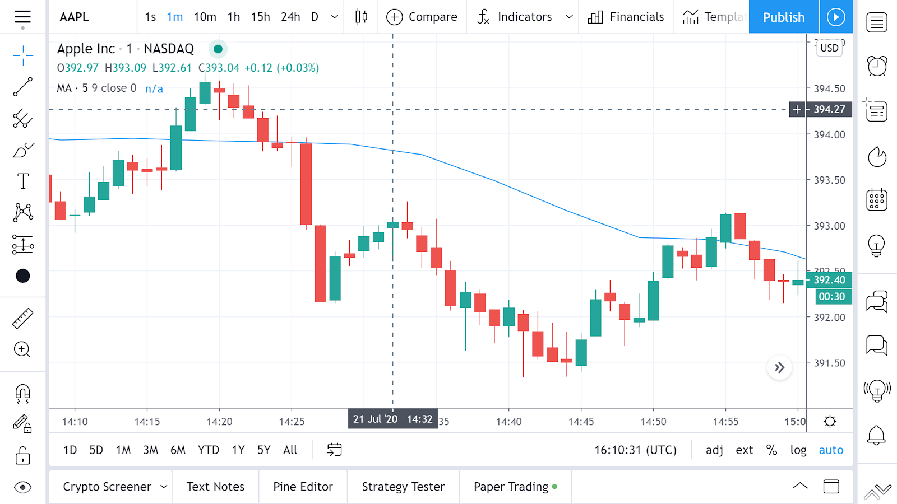

# Проектная работа "Высоконагруженный сервис торговой истории (OHLC данных)"

Данная проектная работа выполнена в рамках курса OTUS ["Highload Architect"](https://otus.ru/lessons/highloadarchitect)

## Содержание

**[1. Введение](#intro)**

**[2. Мотивация](#motivation)**

**[3. Цели проекта](#goals)**

  * [3.1. Масштабирование](#goals-scalability)
  * [3.2. Отказоустойчивость](#goals-reliability)
  * [3.3. Производительность](#goals-performance)

**[4. Разработанная архитектура](#architecture)**

  * [4.1. Общая схема](#architecture-scheme)
  * [4.2. Устройство шарда](#architecture-shard)
  * [4.3. Пример разбиения на шарды](#architecture-example)

**[5. Исследование оптимального хранилища](#storage)**

  * [5.1. Постановка задачи](#storage-task)
  * [5.2. Профиль нагрузки](#storage-profile)
  * [5.3. Тестовые данные и метод тестирования](#storage-test)
  * [5.4. Исследованные хранилища](#storage-investigration)
  
      * [5.4.1. SQLServer](#storage-investigration-sqlserver)
      * [5.4.2. PostgreSQL](#storage-investigration-postgres)
      * [5.4.3. TimescaleDB](#storage-investigration-timescale)
      * [5.4.4. Redis](#storage-investigration-redis)
      * [5.4.5. InfluxDB 2.0](#storage-investigration-influx)
      * [5.4.6. VictoriaMetrics](#storage-investigration-victoris)
      * [5.4.7. Singledtore](#storage-investigration-singlestore)
      * [5.4.8. MongoDB](#storage-investigration-mongo)
      * [5.4.9. Custom store](#storage-investigration-custom)
  
  * [5.5. Сравнительный обзор](#storage-comparison)
  * [5.6. Выводы](#storage-results)

**[6. Разработка MVP](#mvp)**

  * [6.1. Цели MVP](#mvp-goals)
  * [6.2. Что вошло в MVP](#mvp-structure)
  * [6.3. Нагрузочное тестирование](#mvp-loadtesting)

**[7. План развития](#plan)**

  * [7.1. Обновления графиков в реальном времени](#plan-realtime)
  * [7.2. Разработка хранилища](#plan-storage)
  * [7.3. Консистентность кэша в реальном времени](#plan-cache)

**[8. Выводы](#heading--1)**

**[9. Ссылки](#heading--1)**

 

## 1. Введение

Одна из важных функций торговой платформы - предоставление пользователям инструментов по анализу торговой истории. На основе этого могут приниматься решения о совершении сделок, их объемах и т.д. Для брокера важно обеспечивать всем пользователям доступ к этим инструментам и данным.

Далее в отчете будут использоваться следующие термины:
1. Свеча (англ. OHLC/Bar/Candle). Представляет собой агрегированную информацию о движении цены инструмента за определенный период. Включает в себя такие значения, как: O (Open) - цена открытия, H (High) - наибольшая цена за период, L (Low) - наименьшая цена за период, C (Close) - цена закрытия, V(Volume) - суммарный объем сделок за период.

2. Период - временной интервал, за который измеряется изменение цен. В данной платформе имеем следующие периоды: M1 - 1 минута, M5 - 5 минут, M15 - 15 минут, M30 - 30 минут, H1 - 1 час, H4 - 4 часа, D1 - 1 день, W1 - 1 неделя, MO1 - 1 месяц

3. Чарт - интерактивный график изменения цены.   

 

## 2. Мотивация

В стартовой точке имеем следующую ситуацию: есть монолитный бэкенд торговой платформы, который отвечает за обслуживание клиентов, построение котировок и баров, исполнение ордеров и т.д. Все приложение находится на одном хосте, соответственно не может быть масштабировано. Также имеют место проблемы с отказом/замедлением других сервисов при большой нагрузке на один из них. Также со временем и увеличением количества данных сервис торговой истории деградировал до небольших показателей RPS на очень мощном сервере.   
В результате было принято решение, что вертикальное масштабирование уже не может решить проблему, и необходимо отпилить от монолита сервис торговой истории. Данный сервис должен стать независимым от других частей системы, горизантально масштабируемым, и выдерживать бОльшие нагрузки по сравнению с текущим вариантом.

 

## 3. Цели проекта

Для устранения текущих проблем, и, соответственно, успешной реализации проекта были поставлены следующие цели:

### 3.1. Масштабирование

Система должна иметь возможность горизонтального масштабирования. Как везде в торговле, логичнее всего шардировать по торговому инструменту. Например все запросы для инструмена AAPL обслуживается шардом 1, а для инструмента BTC/USD - шардом 5. 

### 3.2. Отказоустойчивость

Система должна иметь лучшую отказоустойчивость, чем текущая система. При деградации одной из других систем (торговля), либо при деградации самой системы не должны деградировать и отказывать другие системы.

### 3.3. Производительность

Система должна иметь лучшую производительность, чем текущая система. Ожидается улучшение пропускной способности в 10 раз (при возможности дальнейшего масштабирования).

 

## 4. Разработанная архитектура

